# [ 콜택시 예약 ]

Final Project AWS 3차수 - 개인평가 제출자료입니다. 

# Table of contents

- [콜텍시 예약](#---)
  - [서비스 시나리오](#시나리오)
  - [분석/설계](#분석-설계)
  - [구현:](#구현)
    - [DDD 의 적용](#ddd-의-적용)
    - [폴리글랏 퍼시스턴스](#폴리글랏-퍼시스턴스)
    - [폴리글랏 프로그래밍](#폴리글랏-프로그래밍)
    - [Correlation](#Corrlation)
    - [동기식 호출 과 Fallback 처리](#동기식-호출-과-Fallback-처리)       
    - [비동기식 호출 과 Eventual Consistency](#비동기식-호출--시간적-디커플링--장애격리--최종-eventual-일관성-테스트)
    - [API Gateway](#API-게이트웨이-(gateway))                            
    - [SAGA-CQRS](#마이페이지)           
  - [운영](#운영)
    - 컨테이너 이미지 생성 및 배포(#컨테이너-이미지-생성-및-배포)
    - [동기식 호출 / Circuit Breaker](#동기식-호출--Circuit-Breaker) 
    - [오토스케일 아웃](#오토스케일-아웃)
    - [무정지 재배포(Readiness Probe)](#무정지-배포(Readiness-Probe))
    - [Self Healing(Liveness Probe)](#Self-Healing(Liveness-Probe))
    - [ConfigMap / Persistence Volume](#Config-Map/Persistence-Volume) 


## 시나리오

콜택시 예약 시스템에서 요구하는 기능/비기능 요구사항은 다음과 같습니다. 
고객이 콜택시 예약과 동시에 결제를 진행하면
콜택시 회사 관리자가 예약을 확정하는 시스템입니다.
사용자는 진행상황을 확인할 수 있고, SMS로도 예약상태가 전송된다. 


#### 기능적 요구사항

1. 고객이 원하는 택시 등급을 선택하고 예약한다.
2. 고객이 결제를 진행한다.
3. 예약이 신청 되면 신청내역이 콜택시 회사에 전달된다. 
4. 콜택시 관리자가 신청내역을 확인하여 예약을 확정한다. 
5. 고객이 예약을 취소할 수 있다.
6. 예약이 취소 되면 콜택시 예약이 취소 된다.
7. 예약이 취소 되면 결제도 취소된다.
8. 고객이 예약 취소를 하면 예약 정보는 삭제 상태로 갱신 된다.
9. 고객이 예약 진행상태를 원할 때마다 조회한다.
10. 예약 상태가 변경되면 SMS로도 확인된다.
11. 콜택시 기사는 택시 가용정보를 등록한다.
12. 콜택시 관리자가 고객을 배정하면 택시 가용수량이 차감된다.


#### 비 기능적 요구사항

1. 트랜잭션
   - 결제가 되지 않으면 콜택시 예약 신청이 처리되지 않아야 한다. `Sync 호출`
   - 예약이 취소되면 결제도 취소가 되어야 한다. `Sync 호출`

2. 장애격리
   - 콜택시 관리자 기능이 수행 되지 않더라도 예약은 365일 24시간 받을 수 있어야 한다. `Pub/Sub`
   - 결제 시스템이 과중되면 사용자를 잠시동안 받지 않고 결제를 잠시후에 하도록 유도 한다.
     (장애처리)

3. 성능
   - 고객이 예약 확인 상태를 마이페이지에서 확인할 수 있어야 한다. `CQRS`
   - 예약 상태가 바뀔 때 마다 SMS로 알림이 발송되어야 한다.


# 분석 설계

## Event Storming

#### Initial - 이벤트 및 어그리게이트 도출
 - MSA-EZ 툴에서 이벤트스토밍 작업
 - 각 도메인별 command,event,aggregate,policy를 도출
 - 이후 java 소스로의 컨버전을 고려하여 네이밍을 영문자로 변경 적용
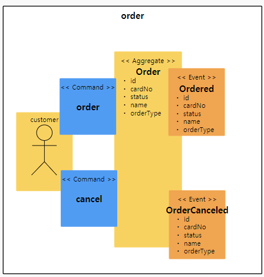
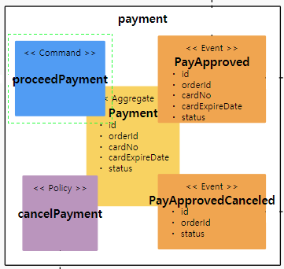
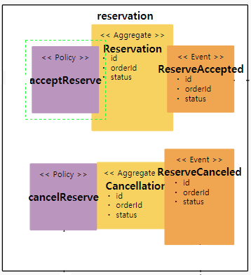
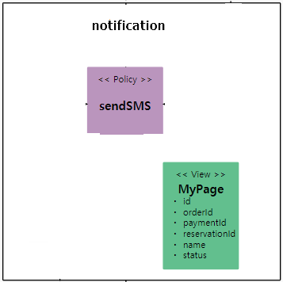
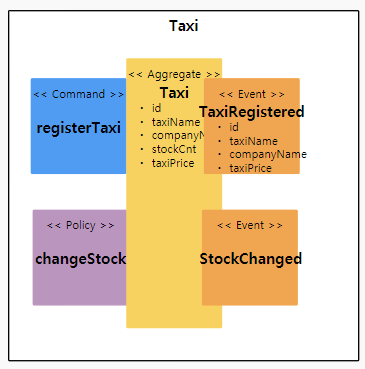

#### Final - relation 정의 및 attribute 생성
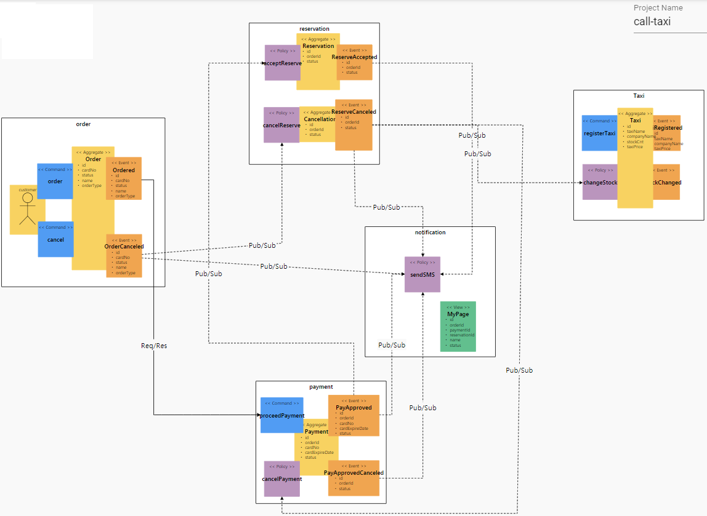

### 기능 요구사항을 커버하는지 검증
1. 고객이 원하는 택시 등급을 선택하고 예약한다. ---> OK
2. 고객이 결제를 진행한다. ---> OK
3. 예약이 신청 되면 신청내역이 콜택시 회사에 전달된다. ---> OK
4. 콜택시 관리자가 신청내역을 확인하여 예약을 확정한다. ---> OK
5. 고객이 예약을 취소할 수 있다. ---> OK
6. 예약이 취소 되면 콜택시 예약이 취소 된다. ---> OK
7. 예약이 취소 되면 결제도 취소된다. ---> OK
8. 고객이 예약 취소를 하면 예약 정보는 삭제 상태로 갱신 된다. ---> OK
9. 고객이 예약 진행상태를 원할 때마다 조회한다. ---> OK
10. 예약 상태가 변경되면 SMS로도 확인된다. ---> OK
11. 콜택시 기사는 택시 가용정보를 등록한다. ---> OK
12. 콜택시 관리자가 고객을 배정하면 택시 가용수량이 차감된다. ---> OK


### 비기능 요구사항을 커버하는지 검증

1. 트랜잭션
   - 결제가 되지 않으면 콜택시 예약 신청이 처리되지 않아야 한다. `Sync 호출`
   - 예약이 취소되면 결제도 취소가 되어야 한다. `Sync 호출`
   ==>  Request-Response 동기 호출 방식으로 처리
   
2. 장애격리
   - 콜택시 관리자 기능이 수행 되지 않더라도 예약은 365일 24시간 받을 수 있어야 한다. `Pub/Sub`
   ==>  Pub/Sub 비동기 호출 방식으로 처리
   - 결제 시스템이 과중되면 사용자를 잠시동안 받지 않고 결제를 잠시후에 하도록 유도한다. (장애처리)
   ==>  Circuit Breaker 방식으로 부하 조절 처리

3. 성능
   - 고객이 예약 확인 상태를 마이페이지에서 확인할 수 있어야 한다. `CQRS`
   - 예약 상태가 바뀔 때 마다 SMS로 알림이 발송되어야 한다.
   ==> CQRS 패턴 적용


## 구현
분석/설계 단계에서 도출된 헥사고날 아키텍처를 적용하여 각 BC별로 대변되는 마이크로서비스들을 스프링부트로 구현한다.
각 서비스 별로 포트넘버 부여 확인 ( 8081 ~ 8085 )

### 포트넘버 분리
```
spring:
  profiles: default
  cloud:
    gateway:
      routes:
        - id: order
          uri: http://localhost:8081
          predicates:
            - Path=/orders/** 
        - id: reservation
          uri: http://localhost:8082
          predicates:
            - Path=/reservations/**,/cancellations/** 
        - id: payment
          uri: http://localhost:8083
          predicates:
            - Path=/paymentHistories/** 
        - id: notification
          uri: http://localhost:8084
          predicates:
            - Path= /mypages/**
        - id: taxi
          uri: http://localhost:8085
          predicates:
            - Path=/taxis/**
```

### 각 서비스를 수행
```
cd /home/project/call-taxi/order
mvn spring-boot:run

cd /home/project/call-taxi/payment
mvn spring-boot:run

cd /home/project/call-taxi/reservation
mvn spring-boot:run

cd /home/project/call-taxi/notification
mvn spring-boot:run

cd /home/project/call-taxi/taxi
mvn spring-boot:run

netstat -anlp | grep :808
```

## DDD 의 적용

- 각 서비스내에 도출된 핵심 Aggregate Root 객체를 Entity 로 선언한다.
- (예시는 order 마이크로 서비스).
```
package calltaxi;

import javax.persistence.*;
import org.springframework.beans.BeanUtils;

import calltaxi.external.PaymentHistory;

@Entity
@Table(name="Order_table")
public class Order {

    @Id
    @GeneratedValue(strategy=GenerationType.AUTO)
    private Long id;
    private String orderType;
    private Long cardNo;
    private String name;
    private String status;

    @PostPersist
    public void onPostPersist(){
        Ordered ordered = new Ordered();
        BeanUtils.copyProperties(this, ordered);
        ordered.publishAfterCommit();

        PaymentHistory payment = new PaymentHistory();
        System.out.println("this.id() : " + this.id);
        payment.setOrderId(this.id);
        payment.setStatus("Reservation OK");
  
        OrderApplication.applicationContext.getBean(calltaxi.external.PaymentHistoryService.class).pay(payment);
    }

    @PostUpdate
    public void onPostUpdate(){
    	System.out.println("Order Cancel  !!");
        OrderCanceled orderCanceled = new OrderCanceled();
        BeanUtils.copyProperties(this, orderCanceled);
        orderCanceled.publishAfterCommit();
    }

    public Long getId() {
        return id;
    }

    public void setId(Long id) {
        this.id = id;
    }
    
    public String getOrderType() {
        return orderType;
    }

    public void setOrderType(String orderType) {
        this.orderType = orderType;
    }
    public Long getCardNo() {
        return cardNo;
    }

    public void setCardNo(Long cardNo) {
        this.cardNo = cardNo;
    }

    public String getName() {
        return name;
    }

    public void setName(String name) {
        this.name = name;
    }
    public String getStatus() {
        return status;
    }

    public void setStatus(String status) {
        this.status = status;
    }
}

```

- Entity Pattern 과 Repository Pattern 을 적용하여 JPA 를 통하여 다양한 데이터소스 유형 (RDB or NoSQL) 에 대한 별도의 처리가 없도록 
데이터 접근 어댑터를 자동 생성하기 위하여 Spring Data REST의 RestRepository를 적용하였다.
```
package calltaxi;

import org.springframework.data.repository.PagingAndSortingRepository;

public interface OrderRepository extends PagingAndSortingRepository<Order, Long>{
}
```

- 적용 후 REST API 의 테스트
```
# Order 서비스의 주문처리
root@labs-1176757103:/home/project# http localhost:8081/orders orderType=basic name=Jung
HTTP/1.1 201 
Content-Type: application/json;charset=UTF-8
Date: Thu, 08 Jul 2021 02:42:55 GMT
Location: http://localhost:8081/orders/1
Transfer-Encoding: chunked

{
    "_links": {
        "order": {
            "href": "http://localhost:8081/orders/1"
        },
        "self": {
            "href": "http://localhost:8081/orders/1"
        }
    },
    "cardNo": null,
    "name": "Jung",
    "orderType": "basic",
    "status": "null"
}

# Pay 서비스의 결제처리
root@labs-1176757103:/home/project# http localhost:8083/paymentHistories orderId=1 cardNo=383824245656 status=valid
HTTP/1.1 201 
Content-Type: application/json;charset=UTF-8
Date: Thu, 08 Jul 2021 02:43:10 GMT
Location: http://localhost:8083/paymentHistories/2
Transfer-Encoding: chunked

{
    "_links": {
        "paymentHistory": {
            "href": "http://localhost:8083/paymentHistories/2"
        },
        "self": {
            "href": "http://localhost:8083/paymentHistories/2"
        }
    },
    "cardNo": "383824245656",
    "orderId": 1,
    "status": "valid"
}

# Reservation 서비스의 예약처리
root@labs-1176757103:/home/project# http localhost:8082/reservations orderId=1 status="confirmed"
HTTP/1.1 201 
Content-Type: application/json;charset=UTF-8
Date: Thu, 08 Jul 2021 02:43:21 GMT
Location: http://localhost:8082/reservations/3
Transfer-Encoding: chunked

{
    "_links": {
        "reservation": {
            "href": "http://localhost:8082/reservations/3"
        },
        "self": {
            "href": "http://localhost:8082/reservations/3"
        }
    },
    "orderId": 1,
    "status": "confirmed"
}

# Notificaion 서비스의 주문상태 확인
root@labs-1176757103:/home/project# http localhost:8084/mypages/1
HTTP/1.1 200 
Content-Type: application/hal+json;charset=UTF-8
Date: Thu, 08 Jul 2021 02:44:06 GMT
Transfer-Encoding: chunked

{
    "_links": {
        "mypage": {
            "href": "http://localhost:8084/mypages/1"
        },
        "self": {
            "href": "http://localhost:8084/mypages/1"
        }
    },
    "name": "Jung",
    "orderId": 1,
    "reservationId": 3,
    "status": "confirmed"
}

# Taxi 서비스의 콜택시 등록
root@labs-1176757103:/home/project# http localhost:8085/taxis taxiName=sonata companyName=tmap stockCnt=10 itemPrice=4900
HTTP/1.1 201 
Content-Type: application/json;charset=UTF-8
Date: Thu, 08 Jul 2021 02:48:20 GMT
Location: http://localhost:8085/taxis/1
Transfer-Encoding: chunked

{
    "_links": {
        "self": {
            "href": "http://localhost:8085/taxis/1"
        },
        "taxi": {
            "href": "http://localhost:8085/taxis/1"
        }
    },
    "companyName": "tmap",
    "itemPrice": 4900,
    "stockCnt": 10,
    "taxiName": "sonata"
}

```

## 폴리글랏 퍼시스턴스
비지니스 로직은 내부에 순수한 형태로 구현
그 이외의 것을 어댑터 형식으로 설계 하여 해당 비지니스 로직이 어느 환경에서도 잘 도작하도록 설계

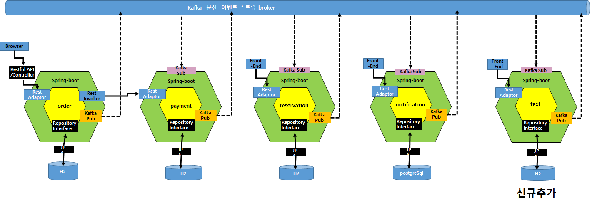

폴리그랏 퍼시스턴스 요건을 만족하기 위해 Order 서비스의 pom.xml 파일에서 기존 h2를 hsqldb로 변경

```
<!--		<dependency>-->
<!--			<groupId>com.h2database</groupId>-->
<!--			<artifactId>h2</artifactId>-->
<!--			<scope>runtime</scope>-->
<!--		</dependency>-->

		<dependency>
			<groupId>org.hsqldb</groupId>
			<artifactId>hsqldb</artifactId>
			<version>2.4.0</version>
			<scope>runtime</scope>
		</dependency>

# DB 변경 및 재기동 후 Order 서비스에서 주문 등록
root@labs-1176757103:/home/project# http localhost:8081/orders orderType=platinum name=ysjung
HTTP/1.1 201 
Content-Type: application/json;charset=UTF-8
Date: Thu, 08 Jul 2021 02:56:33 GMT
Location: http://localhost:8081/orders/1
Transfer-Encoding: chunked

{
    "_links": {
        "order": {
            "href": "http://localhost:8081/orders/1"
        },
        "self": {
            "href": "http://localhost:8081/orders/1"
        }
    },
    "cardNo": null,
    "name": "ysjung",
    "orderType": "platinum",
    "status": null
}

# MyPage에서 주문이 저장이 잘 되었는지 조회
root@labs-1176757103:/home/project# http localhost:8084/mypages/1
HTTP/1.1 200 
Content-Type: application/hal+json;charset=UTF-8
Date: Thu, 08 Jul 2021 02:57:13 GMT
Transfer-Encoding: chunked

{
    "_links": {
        "mypage": {
            "href": "http://localhost:8084/mypages/1"
        },
        "self": {
            "href": "http://localhost:8084/mypages/1"
        }
    },
    "name": "ysjung",
    "orderId": 1,
    "reservationId": 4,
    "status": "Reservation Complete"
}
```

## 동기식 호출 과 Fallback 처리

주문 시 주문과 결제처리를 동기식으로 처리하는 요구사항이 있다. 호출 프로토콜은 이미 앞서 Rest Repository에 의해 노출되어있는 REST 서비스를 FeignClient 를 이용하여 호출하도록 한다.

주문(Order)서비스에서 결제서비스를 호출하기 위에 FeignClient 를 활용하여 Proxy를 구현하였다.
분석단계에서의 조건 중 하나로 주문(order) -> 결제(pay) 간의 호출은 동기식 일관성을 유지하는 트랜잭션으로 처리한다.
호출 프로토콜은 이미 앞서 Rest Repository 에 의해 노출되어있는 REST 서비스를 FeignClient를 이용한다. 

- 결제서비스를 호출하기 위하여 FeignClient를 이용하여 Service 대행 인터페이스 (Proxy) 를 구현 
```
# (order) PaymentHistoryService.java

package calltaxi.external;

import org.springframework.cloud.openfeign.FeignClient;
import org.springframework.web.bind.annotation.RequestBody;
import org.springframework.web.bind.annotation.RequestMapping;
import org.springframework.web.bind.annotation.RequestMethod;

@FeignClient(name="payment", url="${api.payment.url}")
public interface PaymentHistoryService {
    @RequestMapping(method= RequestMethod.POST, path="/paymentHistories")
    public void pay(@RequestBody PaymentHistory paymentHistory);
}                      
```

- 주문을 받은 직후(@PostPersist) 결제를 요청하도록 처리
```
# (order) Order.java
    @PostPersist
    public void onPostPersist(){
        Ordered ordered = new Ordered();
        BeanUtils.copyProperties(this, ordered);
        ordered.publishAfterCommit();

        calltaxi.external.PaymentHistory paymentHistory = new calltaxi.external.PaymentHistory();

        PaymentHistory payment = new PaymentHistory();
        System.out.println("this.id() : " + this.id);
        payment.setOrderId(this.id);
        payment.setStatus("Reservation OK");
        
        OrderApplication.applicationContext.getBean(calltaxi.external.PaymentHistoryService.class).pay(payment);
    }
```

- 동기식 호출에서는 호출 시간에 따른 타임 커플링이 발생하며, 결제 시스템이 장애가 나면 주문도 못받는다는 것을 확인:
```
# 결제(payment) 서비스를 Ctrl+C로 중지하고, 주문(order) 서비스에서 주문 수행 시 오류 발생 확인
root@labs-1176757103:/home/project# http localhost:8081/orders orderType=prime name=Toms
HTTP/1.1 500 
Connection: close
Content-Type: application/json;charset=UTF-8
Date: Thu, 08 Jul 2021 03:02:28 GMT
Transfer-Encoding: chunked

{
    "error": "Internal Server Error",
    "message": "Could not commit JPA transaction; nested exception is javax.persistence.RollbackException: Error while committing the transaction",
    "path": "/orders",
    "status": 500,
    "timestamp": "2021-07-08T03:02:28.066+0000"
}

#결제(payment) 서비스 재기동 확인
cd /home/project/calltaxi/payment
mvn spring-boot:run
~~
2021-07-08 03:02:57.391  INFO 4493 --- [           main] o.s.b.w.embedded.tomcat.TomcatWebServer  : Tomcat started on port(s): 8083 (http) with context path ''
2021-07-08 03:02:57.393  INFO 4493 --- [           main] healthcenter.PaymentApplication          : Started PaymentApplication in 7.514 seconds (JVM running for 10.257)

#주문(order) 서비스에서 주문 재수행 결과 정상 확인
root@labs-1176757103:/home/project# http localhost:8081/orders orderType=prime name=Toms
HTTP/1.1 201 
Content-Type: application/json;charset=UTF-8
Date: Thu, 08 Jul 2021 03:04:03 GMT
Location: http://localhost:8081/orders/3
Transfer-Encoding: chunked

{
    "_links": {
        "order": {
            "href": "http://localhost:8081/orders/3"
        },
        "self": {
            "href": "http://localhost:8081/orders/3"
        }
    },
    "cardNo": null,
    "name": "Toms",
    "orderType": "prime",
    "status": null
}
```

## 비동기식 호출 / 시간적 디커플링 / 장애격리 / 최종 (Eventual) 일관성 테스트

결제가 이루어진 후에 콜택시 예약시스템으로 이를 알려주는 행위는 동기식이 아니라 비동기식으로 처리하여 
원활한 예약(reservation) 서비스의 처리를 위하여 주문/결제 처리가 블로킹 되지 않도록 한다.
 
- 이를 위하여 결제이력에 기록을 남긴 후에 바로 결제승인이 되었다는 도메인 이벤트를 카프카로 Publish 한다.
 
```
#PaymentHistory.java

package calltaxi;

import javax.persistence.*;
import org.springframework.beans.BeanUtils;
import java.util.List;

@Entity
@Table(name="PaymentHistory_table")
public class PaymentHistory {

    @PostPersist
    public void onPostPersist(){
        PaymentApproved paymentApproved = new PaymentApproved();
        paymentApproved.setStatus("Pay Approved!!");
        BeanUtils.copyProperties(this, paymentApproved);
        paymentApproved.publishAfterCommit();
    }
```

- 예약(reservation) 서비스에서는 결제승인 이벤트에 대해서 이를 수신하여 자신의 정책을 처리하도록 PolicyHandler를 구현한다.

```
# (reservation) PolicyHandler.java

package calltaxi;

import calltaxi.config.kafka.KafkaProcessor;
import com.fasterxml.jackson.databind.DeserializationFeature;
import com.fasterxml.jackson.databind.ObjectMapper;
import org.springframework.beans.factory.annotation.Autowired;
import org.springframework.cloud.stream.annotation.StreamListener;
import org.springframework.messaging.handler.annotation.Payload;
import org.springframework.stereotype.Service;

@Service
public class PolicyHandler{

    @Autowired
    private ReservationRepository reservationRepository;

    @StreamListener(KafkaProcessor.INPUT)
    public void wheneverPaymentApproved_(@Payload PaymentApproved paymentApproved){
        if(paymentApproved.isMe()){
            System.out.println("##### listener  : " + paymentApproved.toJson());
            Reservation reservation = new Reservation();
            reservation.setStatus("Reservation Complete");
            reservation.setOrderId(paymentApproved.getOrderId());
            reservationRepository.save(reservation);
        }
    }
}
```

예약서비스은 주문/결제서비스와 완전히 분리 되어 이벤트 수신에 따라 처리되기 때문에, 예약서비스가 잠시 중지된 상태라도 예약 주문을 받는데 문제가 없어야 한다.

```
# 예약(reservation) 서비스를 Ctrl+C로 중지하고, 주문(order) 서비스에서 주문 수행 시 오류 발생 확인 
2021-07-08 03:08:48.761  INFO 3025 --- [       Thread-7] o.s.i.monitor.IntegrationMBeanExporter   : Summary on shutdown: event-in
2021-07-08 03:08:48.761  INFO 3025 --- [       Thread-7] o.s.i.monitor.IntegrationMBeanExporter   : Summary on shutdown: _org.springframework.integration.errorLogger.handler
2021-07-08 03:08:48.761  INFO 3025 --- [       Thread-7] o.s.i.monitor.IntegrationMBeanExporter   : Summary on shutdown: org.springframework.cloud.stream.binding.DispatchingStreamListenerMessageHandler@2c852abc
2021-07-08 03:08:48.762  INFO 3025 --- [       Thread-7] com.zaxxer.hikari.HikariDataSource       : HikariPool-1 - Shutdown initiated...
2021-07-08 03:08:48.765  INFO 3025 --- [       Thread-7] com.zaxxer.hikari.HikariDataSource       : HikariPool-1 - Shutdown completed.

# 주문처리
http localhost:8081/orders orderType=prime name=Jane   #Success

# 결제처리
http localhost:8083/paymentHistories orderId=3 cardNo=383824245656 status=valid    #Success

# 주문 등록하였으나 주문상태는 안바뀜 확인
root@labs-1176757103:/home/project# http localhost:8081/orders/3   
HTTP/1.1 200 
Content-Type: application/hal+json;charset=UTF-8
Date: Thu, 08 Jul 2021 03:14:14 GMT
Transfer-Encoding: chunked

{
    "_links": {
        "order": {
            "href": "http://localhost:8081/orders/3"
        },
        "self": {
            "href": "http://localhost:8081/orders/3"
        }
    },
    "cardNo": null,
    "name": "Jane",
    "orderType": "prime",
    "status": null
}

# 예약(reservation) 서비스 기동
cd /home/project/calltaxi/reservation
mvn spring-boot:run

# MyPage에서 주문상태가 "Reservation Complete"으로 확인
root@labs-1176757103:/home/project# http localhost:8084/mypages/5
HTTP/1.1 200 
Content-Type: application/hal+json;charset=UTF-8
Date: Thu, 08 Jul 2021 03:31:51 GMT
Transfer-Encoding: chunked

{
    "_links": {
        "mypage": {
            "href": "http://localhost:8084/mypages/5"
        },
        "self": {
            "href": "http://localhost:8084/mypages/5"
        }
    },
    "name": "Jane",
    "orderId": 3,
    "reservationId": 2,
    "status": "Reservation Complete"
}
```

## API 게이트웨이(gateway)

API gateway 를 통해 MSA 진입점을 통일시킨다.

```
# gateway 기동(8080 포트)
cd gateway
mvn spring-boot:run

# api gateway를 통한 택시 등록
root@labs-1176757103:/home/project# http localhost:8080/taxis taxiName=eclass companyName=kakao stockCnt=4 itemPrice=6000
HTTP/1.1 201 
Content-Type: application/json;charset=UTF-8
Date: Thu, 08 Jul 2021 03:12:21 GMT
Location: http://localhost:8085/taxis/1
Transfer-Encoding: chunked

{
    "_links": {
        "self": {
            "href": "http://localhost:8085/taxis/1"
        },
        "taxi": {
            "href": "http://localhost:8085/taxis/1"
        }
    },
    "companyName": "kakao",
    "itemPrice": 6000,
    "stockCnt": 4,
    "taxiName": "eclass"
}
```

```
application.yml

server:
  port: 8080

---
spring:
  profiles: default
  cloud:
    gateway:
      routes:
        - id: order
          uri: http://localhost:8081
          predicates:
            - Path=/orders/** 
        - id: reservation
          uri: http://localhost:8082
          predicates:
            - Path=/reservations/**,/cancellations/** 
        - id: payment
          uri: http://localhost:8083
          predicates:
            - Path=/paymentHistories/** 
        - id: notification
          uri: http://localhost:8084
          predicates:
            - Path= /mypages/**
        - id: taxi
          uri: http://localhost:8085
          predicates:
            - Path= /taxis/**
      globalcors:
        corsConfigurations:
          '[/**]':
            allowedOrigins:
              - "*"
            allowedMethods:
              - "*"
            allowedHeaders:
              - "*"
            allowCredentials: true
---

spring:
  profiles: docker
  cloud:
    gateway:
      routes:
        - id: order
          uri: http://order:8080
          predicates:
            - Path=/orders/** 
        - id: reservation
          uri: http://reservation:8080
          predicates:
            - Path=/reservations/**,/cancellations/** 
        - id: payment
          uri: http://payment:8080
          predicates:
            - Path=/paymentHistories/** 
        - id: notification
          uri: http://customer:8080
          predicates:
            - Path= /mypages/**
        - id: taxi
          uri: http://taxi:8080
          predicates:
            - Path= /taxis/**
      globalcors:
        corsConfigurations:
          '[/**]':
            allowedOrigins:
              - "*"
            allowedMethods:
              - "*"
            allowedHeaders:
              - "*"
            allowCredentials: true
            
logging:
  level:
    root: debug

server:
  port: 8080
```
## 마이페이지
# CQRS
- 고객이 예약 건에 대한 Status를 조회할 수 있도록 CQRS로 구현하였음.
-  MyPage 조회를 통해 모든 예약건에 대한 상태정보를 확인할 수 있음.

```
# 예약 상태를 MyPage 호출하여 확인
root@labs-1176757103:/home/project# http localhost:8084/mypages
HTTP/1.1 200 
Content-Type: application/hal+json;charset=UTF-8
Date: Thu, 08 Jul 2021 03:57:29 GMT
Transfer-Encoding: chunked

{
    "_embedded": {
        "mypages": [
            {
                "_links": {
                    "mypage": {
                        "href": "http://localhost:8084/mypages/2"
                    },
                    "self": {
                        "href": "http://localhost:8084/mypages/2"
                    }
                },
                "name": "ysjung",
                "orderId": 1,
                "reservationId": null,
                "status": null
            },
            {
                "_links": {
                    "mypage": {
                        "href": "http://localhost:8084/mypages/4"
                    },
                    "self": {
                        "href": "http://localhost:8084/mypages/4"
                    }
                },
                "name": "Toms",
                "orderId": 3,
                "reservationId": null,
                "status": null
            },
            {
                "_links": {
                    "mypage": {
                        "href": "http://localhost:8084/mypages/5"
                    },
                    "self": {
                        "href": "http://localhost:8084/mypages/5"
                    }
                },
                "name": "Jane",
                "orderId": 4,
                "reservationId": 2,
                "status": "Reservation Complete"
            },
            {
                "_links": {
                    "mypage": {
                        "href": "http://localhost:8084/mypages/7"
                    },
                    "self": {
                        "href": "http://localhost:8084/mypages/7"
                    }
                },
                "name": "Jung",
                "orderId": 6,
                "reservationId": 6,
                "status": "Reservation Complete"
            },
            {
                "_links": {
                    "mypage": {
                        "href": "http://localhost:8084/mypages/8"
                    },
                    "self": {
                        "href": "http://localhost:8084/mypages/8"
                    }
                },
                "name": "Emily",
                "orderId": 7,
                "reservationId": 7,
                "status": "Reservation Complete"
            }
        ]
    },
    "_links": {
        "profile": {
            "href": "http://localhost:8084/profile/mypages"
        },
        "search": {
            "href": "http://localhost:8084/mypages/search"
        },
        "self": {
            "href": "http://localhost:8084/mypages"
        }
    }
}
```

# 운영

## 컨테이너 이미지 생성 및 배포

###### ECR 접속 비밀번호 생성
```sh
root@labs-1176757103:/home/project# aws --region "eu-central-1" ecr get-login-password
```
###### ECR 로그인
```sh
root@labs-1176757103:/home/project# docker login --username AWS -p {ECR 접속 비밀번호} 879772956301.dkr.ecr.eu-central-1.amazonaws.com
Login Succeeded
```
###### 마이크로서비스 빌드, order/payment/reservation/notification/taxi 각각 실행
```sh
mvn clean package -B
```

###### 컨테이너 이미지 생성
```sh
docker build -t 879772956301.dkr.ecr.eu-central-1.amazonaws.com/order:v1 .
docker build -t 879772956301.dkr.ecr.eu-central-1.amazonaws.com/payment:v1 .
docker build -t 879772956301.dkr.ecr.eu-central-1.amazonaws.com/reservation:v1 .
docker build -t 879772956301.dkr.ecr.eu-central-1.amazonaws.com/notification:v1 .
docker build -t 879772956301.dkr.ecr.eu-central-1.amazonaws.com/taxi:v1 .

root@labs-1176757103:/home/project# docker images
REPOSITORY                                                     TAG                 IMAGE ID            CREATED             SIZE
879772956301.dkr.ecr.eu-central-1.amazonaws.com/taxi           v1                  8fbc9b692ac1        5 minutes ago       165 MB
879772956301.dkr.ecr.eu-central-1.amazonaws.com/notification   v1                  5aefde5f79db        6 minutes ago       164 MB
879772956301.dkr.ecr.eu-central-1.amazonaws.com/reservation    v1                  bb8447f81251        6 minutes ago       165 MB
879772956301.dkr.ecr.eu-central-1.amazonaws.com/payment        v1                  f2435046a4a9        6 minutes ago       165 MB
879772956301.dkr.ecr.eu-central-1.amazonaws.com/order          v1                  be2f9a5fa42a        6 minutes ago       164 MB
```

###### ECR에 컨테이너 이미지 배포
```sh
docker push 879772956301.dkr.ecr.eu-central-1.amazonaws.com/order:v1
docker push 879772956301.dkr.ecr.eu-central-1.amazonaws.com/payment:v1
docker push 879772956301.dkr.ecr.eu-central-1.amazonaws.com/reservation:v1
docker push 879772956301.dkr.ecr.eu-central-1.amazonaws.com/notification:v1
docker push 879772956301.dkr.ecr.eu-central-1.amazonaws.com/taxi:v1

root@labs-1176757103:/home/project/call-taxi/taxi# docker push 879772956301.dkr.ecr.eu-central-1.amazonaws.com/taxi:v1
The push refers to repository [879772956301.dkr.ecr.eu-central-1.amazonaws.com/taxi]
1a7d23c07998: Pushed 
ceaf9e1ebef5: Pushed 
9b9b7f3d56a0: Pushed 
f1b5933fe4b5: Pushed 
v1: digest: sha256:fbf495efd21eb56355b11c26b86315924e049f5b04866e99e95d96269be93996 size: 1159
```
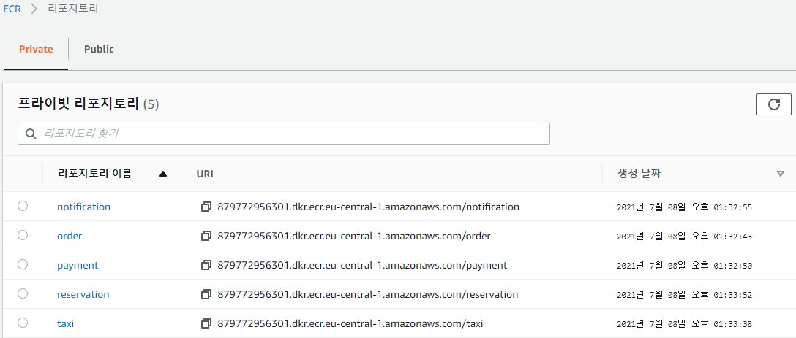
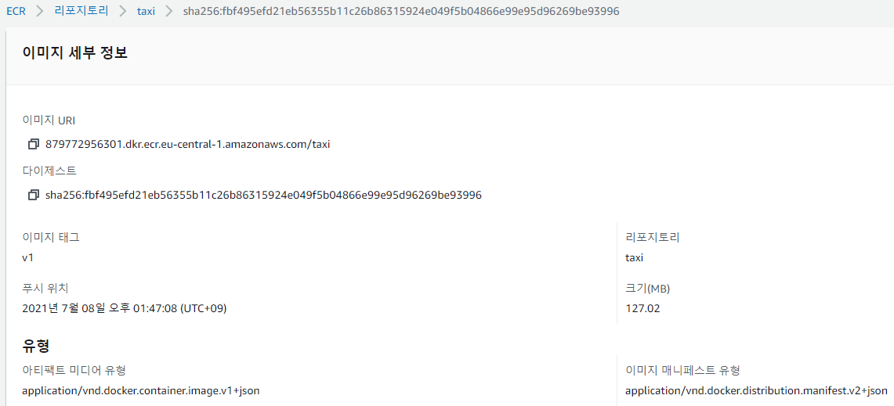

###### EKS에 마이크로서비스 배포, order/payment/reservation/notification/taxi 각각 실행
```sh
kubectl create -f deployment.yml 
```
###### 마이크로서비스 배포 상태 확인
```sh
root@labs-1176757103:/home/project/call-taxi/notification# kubectl get all
NAME                                READY   STATUS    RESTARTS   AGE
pod/notification-6d8c48fb9f-9lsq7   1/1     Running   0          13s
pod/order-66974757fb-7lgmm          1/1     Running   0          23m
pod/payment-66fbb9bb6b-b75h2        1/1     Running   0          21m
pod/reservation-68dc8c44b6-kntqt    1/1     Running   0          21m
pod/taxi-6b6f59bcd6-tw6hd           1/1     Running   0          20m

NAME                 TYPE        CLUSTER-IP   EXTERNAL-IP   PORT(S)   AGE
service/kubernetes   ClusterIP   10.100.0.1   <none>        443/TCP   3h31m

NAME                           READY   UP-TO-DATE   AVAILABLE   AGE
deployment.apps/notification   1/1     1            1           14s
deployment.apps/order          1/1     1            1           23m
deployment.apps/payment        1/1     1            1           21m
deployment.apps/reservation    1/1     1            1           21m
deployment.apps/taxi           1/1     1            1           20m

NAME                                      DESIRED   CURRENT   READY   AGE
replicaset.apps/notification-6d8c48fb9f   1         1         1       15s
replicaset.apps/order-66974757fb          1         1         1       23m
replicaset.apps/payment-66fbb9bb6b        1         1         1       21m
replicaset.apps/reservation-68dc8c44b6    1         1         1       21m
replicaset.apps/taxi-6b6f59bcd6           1         1         1       20m
```

##### Siege Pod 생성
```
root@labs-1176757103:/home/project/call-taxi# kubectl create -f seige.yaml
apiVersion: v1
kind: Pod
metadata:
  name: siege
spec:
  containers:
  - name: siege
    image: apexacme/siege-nginx
pod/siege created
```

###### Siege 생성 확인
```sh
root@labs-1176757103:/home/project/call-taxi# kubectl get pods
NAME                            READY   STATUS    RESTARTS   AGE
notification-6d8c48fb9f-9lsq7   1/1     Running   0          31m
order-66974757fb-7lgmm          1/1     Running   0          55m
payment-66fbb9bb6b-b75h2        1/1     Running   0          53m
reservation-68dc8c44b6-kntqt    1/1     Running   0          53m
siege                           1/1     Running   0          71s
taxi-6b6f59bcd6-tw6hd           1/1     Running   0          52m
```

## 동기식 호출 / Circuit Breaker

* 서킷 브레이킹 프레임워크의 선택: Spring FeignClient + Hystrix 옵션을 사용하여 구현함

시나리오는 주문(order) -> 결제(pay) 처리 연결을 RESTful Request/Response 로 연동하여 구현하고, 결제 요청이 과도할 경우 CB 를 통하여 장애격리.

- Hystrix 를 설정:  요청처리 쓰레드에서 처리시간이 300 밀리가 넘어서기 시작하여 어느정도 유지되면 CB 회로가 닫히도록 (요청을 빠르게 실패처리, 차단) 설정
- 임의의 부하처리를 위해 결제서비스내 sleep을 random하게 적용하였다.
```
# order 서비스, application.yml에 Hysrix 타임아웃 설정
feign:
  hystrix:
    enabled: true

hystrix:
  command:
    default:
      execution.isolation.thread.timeoutInMilliseconds: 300
```
```
# payment 서비스, PaymentHistory.java에 Thread Sleep 처리
public class PaymentHistory {

    @PrePersist
    public void onPrePersist(){
        try{
            Thread.sleep((long)(Math.random() * 1000));
       } catch (InterruptedException e){
           e.printStackTrace();
       }
    }
```
* 부하테스터 Siege 툴을 통한 서킷 브레이커 동작 확인:
- 동시사용자 255명, 60초 동안 실시
```
siege -c255 -t60S -v --content-type "application/json" 'http://order:8080/orders POST {"name": "Jung", "orderType": "prime"}'

HTTP/1.1 500    48.13 secs:     271 bytes ==> POST http://order:8080/orders
HTTP/1.1 201    48.13 secs:     240 bytes ==> POST http://order:8080/orders
HTTP/1.1 201    49.11 secs:     240 bytes ==> POST http://order:8080/orders
HTTP/1.1 201    49.34 secs:     240 bytes ==> POST http://order:8080/orders
HTTP/1.1 201    50.08 secs:     240 bytes ==> POST http://order:8080/orders
HTTP/1.1 500    50.35 secs:     271 bytes ==> POST http://order:8080/orders
HTTP/1.1 201    50.36 secs:     240 bytes ==> POST http://order:8080/orders
HTTP/1.1 201    19.92 secs:     240 bytes ==> POST http://order:8080/orders
HTTP/1.1 500    51.53 secs:     271 bytes ==> POST http://order:8080/orders
HTTP/1.1 201    51.75 secs:     240 bytes ==> POST http://order:8080/orders
HTTP/1.1 201    52.73 secs:     240 bytes ==> POST http://order:8080/orders
HTTP/1.1 201    52.79 secs:     240 bytes ==> POST http://order:8080/orders
HTTP/1.1 201    53.14 secs:     240 bytes ==> POST http://order:8080/orders
HTTP/1.1 201    22.98 secs:     240 bytes ==> POST http://order:8080/orders
HTTP/1.1 201    54.46 secs:     240 bytes ==> POST http://order:8080/orders
HTTP/1.1 201    23.72 secs:     240 bytes ==> POST http://order:8080/orders
HTTP/1.1 201    55.58 secs:     240 bytes ==> POST http://order:8080/orders
HTTP/1.1 500    55.93 secs:     271 bytes ==> POST http://order:8080/orders
HTTP/1.1 201    56.01 secs:     240 bytes ==> POST http://order:8080/orders
HTTP/1.1 201    56.12 secs:     240 bytes ==> POST http://order:8080/orders
HTTP/1.1 201    56.70 secs:     240 bytes ==> POST http://order:8080/orders
HTTP/1.1 201    58.22 secs:     240 bytes ==> POST http://order:8080/orders
HTTP/1.1 201    58.72 secs:     240 bytes ==> POST http://order:8080/orders
HTTP/1.1 201    28.09 secs:     240 bytes ==> POST http://order:8080/orders

Lifting the server siege...
Transactions:                    110 hits
Availability:                  42.31 %
Elapsed time:                  59.40 secs
Data transferred:               0.06 MB
Response time:                 71.77 secs
Transaction rate:               1.85 trans/sec
Throughput:                     0.00 MB/sec
Concurrency:                  132.91
Successful transactions:         110
Failed transactions:             150
Longest transaction:           58.72
Shortest transaction:           1.60

```
- 42.31% 성공

## 오토스케일 아웃
-앞서 CB 는 시스템을 안정되게 운영할 수 있게 해줬지만 사용자의 요청을 100% 받아들여주지 못했기 때문에 이에 대한 보완책으로 자동화된 확장 기능을 적용하고자 한다.
###### order 서비스의 deployment.yml 파일에 resources 설정을 추가한다.
          resources:
            requests:
              cpu: "200m"

###### order 서비스에 대한 replica 를 동적으로 늘려주도록 HPA 를 설정한다.
```
# 설정은 CPU 사용량이 10%를 넘으면 replica 를 10개까지 늘려준다.
root@labs-1176757103:/home/project/call-taxi/payment# kubectl autoscale deployment order --cpu-percent=10 --min=1 --max=10
horizontalpodautoscaler.autoscaling/order autoscaled

# 초기 HPA 확인
root@labs-1176757103:/home/project/call-taxi/payment# kubectl get hpa
NAME    REFERENCE          TARGETS   MINPODS   MAXPODS   REPLICAS   AGE
order   Deployment/order   6%/10%    1         10        1          24s
```

###### 부하를 동시사용자 255명, 60초 동안 걸어준다.
```
siege -c255 -t60S -v --content-type "application/json" 'http://order:8080/orders POST {"status": "ok", "orderType": "prime"}'
```
###### 오토스케일이 적용되는지 order 서비스의 Deployment에 모니터링을 걸어둔다
```
root@labs-1176757103:/home/project/call-taxi/order/kubernetes# kubectl get deploy order -w
NAME    READY   UP-TO-DATE   AVAILABLE   AGE
order   10/10   10           10          11m
order   9/10    10           9           17m
order   8/10    10           8           17m
order   7/10    10           7           17m
order   6/10    10           6           17m
order   5/10    10           5           17m
order   4/10    10           4           17m
order   3/10    10           3           17m
order   2/10    10           2           17m
order   1/10    10           1           18m
order   0/10    10           0           18m
order   1/10    10           1           19m
order   2/10    10           2           19m
order   3/10    10           3           19m
order   4/10    10           4           19m
order   5/10    10           5           19m
order   6/10    10           6           19m
order   7/10    10           7           19m
order   8/10    10           8           19m
order   9/10    10           9           19m
order   10/10   10           10          19m
```

## 무정지 배포(Readiness Probe)

###### payment 서비스의 deployment.yml 파일에 readinessProbe 설정을 추가한다.
```
          readinessProbe:
            httpGet:
              path: '/actuator/health'
              port: 8080
            initialDelaySeconds: 10
            timeoutSeconds: 2
            periodSeconds: 5
            failureThreshold: 10 
```
###### payment 서비스의 readinessProbe 설정을 확인한다.
```
root@labs-1176757103:/home/project/call-taxi/payment/kubernetes# kubectl describe deploy payment
Name:                   payment
Namespace:              default
CreationTimestamp:      Thu, 08 Jul 2021 09:01:09 +0000
Labels:                 app=order
Annotations:            deployment.kubernetes.io/revision: 1
Selector:               app=payment
Replicas:               1 desired | 1 updated | 1 total | 1 available | 0 unavailable
StrategyType:           RollingUpdate
MinReadySeconds:        0
RollingUpdateStrategy:  25% max unavailable, 25% max surge
Pod Template:
  Labels:  app=payment
  Containers:
   payment:
    Image:      879772956301.dkr.ecr.eu-central-1.amazonaws.com/payment:v1
    Port:       8080/TCP
    Host Port:  0/TCP
    Limits:
      cpu:  500m
    Requests:
      cpu:        200m
    Liveness:     http-get http://:8080/actuator/health delay=120s timeout=2s period=5s #success=1 #failure=5
    Readiness:    http-get http://:8080/actuator/health delay=10s timeout=2s period=5s #success=1 #failure=10
    Environment:  <none>
    Mounts:       <none>
  Volumes:        <none>
Conditions:
  Type           Status  Reason
  ----           ------  ------
  Progressing    True    NewReplicaSetAvailable
  Available      True    MinimumReplicasAvailable
OldReplicaSets:  <none>
NewReplicaSet:   payment-8b8df6dd5 (1/1 replicas created)
Events:
  Type    Reason             Age   From                   Message
  ----    ------             ----  ----                   -------
  Normal  ScalingReplicaSet  13m   deployment-controller  Scaled up replica set payment-8b8df6dd5 to 1
```

###### 부하테스트 실행 및 payment 신규 버전(v2) 배포
사용자 100명, 60초 동안 부하를 주고 그 사이 새로운 버전(v2) Image 를 반영 후 deployment.yml을 배포한다.
```
# Set image 명령어를 통해 배포를 수행 한다.
kubectl set image deploy payment payment=879772956301.dkr.ecr.eu-central-1.amazonaws.com/payment:v2
```
```
# Siege 로그를 보면서 배포 시 무정지로 배포되는 것을 확인한다.
siege -c100 -t60S -v --content-type "application/json" 'http://payment:8080/paymentHistories'

HTTP/1.1 200     0.38 secs:     463 bytes ==> GET  /paymentHistories
HTTP/1.1 200     0.28 secs:     463 bytes ==> GET  /paymentHistories
HTTP/1.1 200     0.67 secs:     463 bytes ==> GET  /paymentHistories
HTTP/1.1 200     0.28 secs:     463 bytes ==> GET  /paymentHistories

Lifting the server siege...
Transactions:                   6925 hits
Availability:                 100.00 %
Elapsed time:                  59.32 secs
Data transferred:               3.06 MB
Response time:                  0.70 secs
Transaction rate:             116.74 trans/sec
Throughput:                     0.05 MB/sec
Concurrency:                   81.23
Successful transactions:        6925
Failed transactions:               0
Longest transaction:            3.59
Shortest transaction:           0.00
```

## Self Healing(Liveness Probe)
- deployment.yml 파일에 livenessProbe 설정에 /tmp/healthy 파일이 존재하는지 확인 추가한다.
- periodSeconds 값으로 5초마다/tmp/healthy 파일의 존재 여부를 조회한다.
- 파일이 존재하지 않을 경우, 정상 작동에 문제가 있다고 판단되어 kubelet에 의해 자동으로 컨테이너가 재시작한다.

```
#### payment 서비스의 deployment.yml 파일 수정
livenessProbe:
  exec:
    command:
    - cat 
    - /tmp/healthy
  initialDelaySeconds: 120
  timeoutSeconds: 2
  periodSeconds: 5
  failureThreshold: 5
```

###### payment 서비스의 livenessProbe 설정 적용 확인
```
root@labs-1176757103:/home/project/call-taxi/payment/kubernetes# kubectl describe pod payment
Name:         payment-65dd7b9cb4-l84p8
Namespace:    default
Priority:     0
Node:         ip-192-168-65-147.eu-central-1.compute.internal/192.168.65.147
Start Time:   Thu, 08 Jul 2021 09:39:12 +0000
Labels:       app=payment
              pod-template-hash=65dd7b9cb4
Annotations:  kubernetes.io/psp: eks.privileged
Status:       Running
IP:           192.168.81.176
IPs:
  IP:           192.168.81.176
Controlled By:  ReplicaSet/payment-65dd7b9cb4
Containers:
  payment:
    Container ID:   docker://f57bdd65e2b53fc6281928076844b76563a0c2bd9b7462c420c9a2d74b479840
    Image:          879772956301.dkr.ecr.eu-central-1.amazonaws.com/payment:v1
    Image ID:       docker-pullable://879772956301.dkr.ecr.eu-central-1.amazonaws.com/payment@sha256:e3a45f2ef0b110e76fda9e3226b9a5bb5e096805e8819ffa35e24bd1a02cb223
    Port:           8080/TCP
    Host Port:      0/TCP
    State:          Running
      Started:      Thu, 08 Jul 2021 09:40:34 +0000
    Last State:     Terminated
      Reason:       Error
      Exit Code:    143
      Started:      Thu, 08 Jul 2021 09:40:14 +0000
      Finished:     Thu, 08 Jul 2021 09:40:33 +0000
    Ready:          False
    Restart Count:  4
    Limits:
      cpu:  500m
    Requests:
      cpu:        200m
    Liveness:     exec [cat /tmp/healthy] delay=120s timeout=2s period=5s #success=1 #failure=5 ---> 설정 확인
    Readiness:    http-get http://:8080/actuator/health delay=10s timeout=2s period=5s #success=1 #failure=10
    Environment:  <none>
    Mounts:
      /var/run/secrets/kubernetes.io/serviceaccount from default-token-gcvx6 (ro)
Conditions:
  Type              Status
  Initialized       True 
  Ready             False 
  ContainersReady   False 
  PodScheduled      True 
Volumes:
  default-token-gcvx6:
    Type:        Secret (a volume populated by a Secret)
    SecretName:  default-token-gcvx6
    Optional:    false
QoS Class:       Burstable
Node-Selectors:  <none>
Tolerations:     node.kubernetes.io/not-ready:NoExecute for 300s
                 node.kubernetes.io/unreachable:NoExecute for 300s
Events:
  Type     Reason     Age                From                                                      Message
  ----     ------     ----               ----                                                      -------
  Normal   Scheduled  100s               default-scheduler                                         Successfully assigned default/payment-65dd7b9cb4-l84p8 to ip-192-168-65-147.eu-central-1.compute.internal
  Warning  Unhealthy  61s (x4 over 86s)  kubelet, ip-192-168-65-147.eu-central-1.compute.internal  Readiness probe failed: Get http://192.168.81.176:8080/actuator/health: dial tcp 192.168.81.176:8080: connect: connection refused
  Normal   Killing    59s (x2 over 79s)  kubelet, ip-192-168-65-147.eu-central-1.compute.internal  Container payment failed liveness probe, will be restarted
  Normal   Pulled     58s (x3 over 98s)  kubelet, ip-192-168-65-147.eu-central-1.compute.internal  Successfully pulled image "879772956301.dkr.ecr.eu-central-1.amazonaws.com/payment:v1"
  Normal   Created    58s (x3 over 98s)  kubelet, ip-192-168-65-147.eu-central-1.compute.internal  Created container payment
  Normal   Started    58s (x3 over 98s)  kubelet, ip-192-168-65-147.eu-central-1.compute.internal  Started container payment
  Normal   Pulling    58s (x3 over 98s)  kubelet, ip-192-168-65-147.eu-central-1.compute.internal  Pulling image "879772956301.dkr.ecr.eu-central-1.amazonaws.com/payment:v1"
  Warning  Unhealthy  49s (x7 over 89s)  kubelet, ip-192-168-65-147.eu-central-1.compute.internal  Liveness probe failed: cat: can't open '/tmp/healthy': No such file or directory
```

- 컨테이너 실행 후 초기에 /tmp/healthy 파일이 존재하지 않아 livenessProbe에서 실패를 리턴하게 되고
- payment Pod 정상 상태일 때 진입하여 /tmp/healthy 파일 생성해주면 정상 상태가 유지되는 것을 확인한다.
```
root@labs-1176757103:/home/project/call-taxi/reservation/kubernetes# kubectl exec payment-585fd6b755-c9jp2 -it sh
/ # touch /tmp/healthy

root@labs-1176757103:/home/project# kubectl get pods -w
NAME                            READY   STATUS    			RESTARTS   AGE
payment-585fd6b755-c9jp2        0/1     Pending             0          0s
payment-585fd6b755-c9jp2        0/1     ContainerCreating   0          0s
payment-585fd6b755-c9jp2        0/1     Running             0          2s
payment-585fd6b755-c9jp2        0/1     Running             1          74s
payment-585fd6b755-c9jp2        0/1     Running             2          2m25s
payment-585fd6b755-c9jp2        0/1     Running             3          3m34s
payment-585fd6b755-c9jp2        1/1     Running             3          4m53s
```

## Config Map & Persistence Volume
### 1. Persistence Volume

1. EFS 생성
```
EFS 생성 시 EC2 인스턴스를 EFS에 연결할 때 VPC를 선택해야 하고, 보안 그룹(ClusterSharedNode-SG)을 적용해야 한다.
```
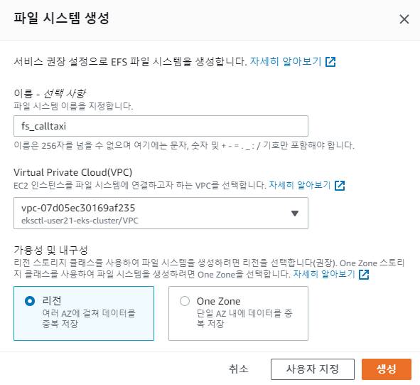
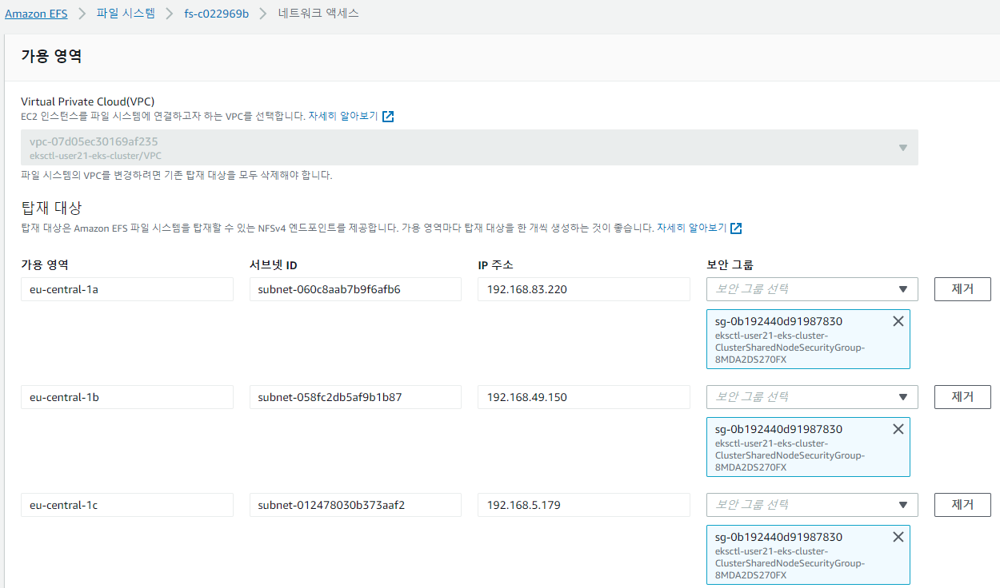

2. EFS 계정 생성 및 ROLE 바인딩
```
root@labs-1176757103:/home/project/call-taxi/refer# kubectl create -f efs-sa.yml
serviceaccount/efs-provisioner created

apiVersion: v1
kind: ServiceAccount
metadata:
  name: efs-provisioner
  namespace: default

root@labs-1176757103:/home/project/call-taxi/refer# kubectl get ServiceAccount efs-provisioner
NAME              SECRETS   AGE
efs-provisioner   1         19s

root@labs-1176757103:/home/project/call-taxi/refer# kubectl create  -f efs-rbac.yml
clusterrole.rbac.authorization.k8s.io/efs-provisioner-runner created
clusterrolebinding.rbac.authorization.k8s.io/run-efs-provisioner created
role.rbac.authorization.k8s.io/leader-locking-efs-provisioner created
rolebinding.rbac.authorization.k8s.io/leader-locking-efs-provisioner created

apiVersion: rbac.authorization.k8s.io/v1
kind: ClusterRole
metadata:
  name: efs-provisioner-runner
  namespace: default
rules:
  - apiGroups: [""]
    resources: ["persistentvolumes"]
    verbs: ["get", "list", "watch", "create", "delete"]
  - apiGroups: [""]
    resources: ["persistentvolumeclaims"]
    verbs: ["get", "list", "watch", "update"]
  - apiGroups: ["storage.k8s.io"]
    resources: ["storageclasses"]
    verbs: ["get", "list", "watch"]
  - apiGroups: [""]
    resources: ["events"]
    verbs: ["create", "update", "patch"]
---
kind: ClusterRoleBinding
apiVersion: rbac.authorization.k8s.io/v1
metadata:
  name: run-efs-provisioner
  namespace: default
subjects:
  - kind: ServiceAccount
    name: efs-provisioner
     # replace with namespace where provisioner is deployed
    namespace: default
roleRef:
  kind: ClusterRole
  name: efs-provisioner-runner
  apiGroup: rbac.authorization.k8s.io
---
kind: Role
apiVersion: rbac.authorization.k8s.io/v1
metadata:
  name: leader-locking-efs-provisioner
  namespace: default
rules:
  - apiGroups: [""]
    resources: ["endpoints"]
    verbs: ["get", "list", "watch", "create", "update", "patch"]
---
kind: RoleBinding
apiVersion: rbac.authorization.k8s.io/v1
metadata:
  name: leader-locking-efs-provisioner
  namespace: default
subjects:
  - kind: ServiceAccount
    name: efs-provisioner
    # replace with namespace where provisioner is deployed
    namespace: default
roleRef:
  kind: Role
  name: leader-locking-efs-provisioner
  apiGroup: rbac.authorization.k8s.io
```

3. EFS Provisioner 배포
```
root@labs-1176757103:/home/project/call-taxi/refer# kubectl create -f efs-provisioner-deploy.yml
deployment.apps/efs-provisioner created

apiVersion: apps/v1
kind: Deployment
metadata:
  name: efs-provisioner
  namespace: default
spec:
  replicas: 1
  strategy:
    type: Recreate
  selector:
    matchLabels:
      app: efs-provisioner
  template:
    metadata:
      labels:
        app: efs-provisioner
    spec:
      serviceAccount: efs-provisioner
      containers:
        - name: efs-provisioner
          image: quay.io/external_storage/efs-provisioner:latest
          env:
            - name: FILE_SYSTEM_ID
              value: fs-c022969b
            - name: AWS_REGION
              value: eu-central-1
            - name: PROVISIONER_NAME
              value: my-aws.com/aws-efs
          volumeMounts:
            - name: pv-volume
              mountPath: /persistentvolumes
      volumes:
        - name: pv-volume
          nfs:
            server: fs-c022969b.efs.eu-central-1.amazonaws.com
            path: /

root@labs-1176757103:/home/project/call-taxi/refer# kubectl get deployment efs-provisioner
NAME              READY   UP-TO-DATE   AVAILABLE   AGE
efs-provisioner   1/1     1            1           11s
```

4. 설치한 Provisioner를 storageclass에 등록
```
root@labs-1176757103:/home/project/call-taxi/refer# kubectl create -f efs-storageclass.yml
storageclass.storage.k8s.io/aws-efs created

kind: StorageClass
apiVersion: storage.k8s.io/v1
metadata:
  name: aws-efs
  namespace: default
provisioner: my-aws.com/aws-efs

root@labs-1176757103:/home/project/call-taxi/refer# kubectl get sc aws-efs
NAME      PROVISIONER          RECLAIMPOLICY   VOLUMEBINDINGMODE   ALLOWVOLUMEEXPANSION   AGE
aws-efs   my-aws.com/aws-efs   Delete          Immediate           false                  9s
```

5. PVC(PersistentVolumeClaim) 생성
```
root@labs-1176757103:/home/project/call-taxi/refer# kubectl create -f volume-pvc.yml
persistentvolumeclaim/aws-efs created

apiVersion: v1
kind: PersistentVolumeClaim
metadata:
  name: aws-efs
  namespace: default
  labels:
    app: test-pvc
spec:
  accessModes:
  - ReadWriteMany
  resources:
    requests:
      storage: 6Ki
  storageClassName: aws-efs
  
root@labs-1176757103:/home/project/call-taxi/refer# kubectl get pvc
NAME      STATUS   VOLUME                                     CAPACITY   ACCESS MODES   STORAGECLASS   AGE
aws-efs   Bound    pvc-c61bc748-f2db-4ac7-ad7d-54dffef329e1   6Ki        RWX            aws-efs        13m
```

6. payment 서비스의 deployment에 PVC 적용
```
root@labs-1176757103:/home/project/call-taxi/payment/kubernetes# kubectl apply -f deployment.yml
deployment.apps/payment configured

		replicas: 2
          volumeMounts:
          - mountPath: '/mnt/efs'
            name: myvolume
      volumes:
        - name: myvolume
          persistentVolumeClaim:
            claimName: aws-efs
```

7. payment 2개 Pod에서 마운트된 경로에 파일이 공유되는 것을 확인함
```
root@labs-1176757103:/home/project/call-taxi/reservation/kubernetes# kubectl exec payment-5996954989-h52l7 -it sh
/ # cd /mnt/efs
/mnt/efs # touch test_pvc
/mnt/efs # ls -al
total 8
drwxrws--x    2 root     2000          6144 Jul  8 11:37 .
drwxr-xr-x    1 root     root            17 Jul  8 11:32 ..
-rw-r--r--    1 root     2000             0 Jul  8 11:37 test_pvc

root@labs-1176757103:/home/project/call-taxi/reservation/kubernetes# kubectl exec payment-585fd6b755-c9jp2 -it sh
/ # ls -al /mnt/efs
total 8
drwxrws--x    2 root     2000          6144 Jul  8 11:37 .
drwxr-xr-x    1 root     root            17 Jul  8 11:32 ..
-rw-r--r--    1 root     2000             0 Jul  8 11:37 test_pvc
```

### Config Map

1: ConfigMap 생성 및 data 속성 정의
```
root@labs-1176757103:/home/project/call-taxi/refer# kubectl apply -f configmap.yml
configmap/calltaxi-config created

apiVersion: v1
kind: ConfigMap
metadata:
  name: calltaxi-config
  namespace: default
data:
  min_tax_price: "3800"
  payment_gateway_server: "http://pg.example.com"
```

2. payment 서비스의 deployment에 ConfigMap 적용
```
root@labs-1176757103:/home/project/call-taxi/payment/kubernetes# kubectl apply -f deployment.yml
deployment.apps/payment configured

          env:
            - name: MIN_TAX_PRICE
              valueFrom:
                configMapKeyRef:
                  name: calltaxi-config
                  key: min_tax_price
            - name: PAYMENT_GATEWAY_SERVER
              valueFrom:
                configMapKeyRef:
                  name: calltaxi-config
                  key: payment_gateway_server
          volumeMounts:
          - mountPath: '/mnt/efs'
            name: myvolume
      volumes:
        - name: myvolume
          persistentVolumeClaim:
            claimName: aws-efs
```

3. 결제(payment) 처리 시에 ConfigMap 환경변수의 값을 /mnt/efs/LOGS 파일에 쓰기 적용
```
    @PostPersist
    public void onPostPersist() {
        try {
            File file = new File("/mnt/efs/LOGS");
            BufferedWriter writer = new BufferedWriter(new FileWriter(file));
            writer.write("OS 환경변수 MIN_TAX_PRICE 값: " + System.getenv("MIN_TAX_PRICE"));
            writer.write("\n");
            writer.write("OS 환경변수 PAYMENT_GATEWAY_SERVER 값: " + System.getenv("PAYMENT_GATEWAY_SERVER"));
            writer.write("\n");
            writer.close();
        } catch (Exception e) {
            e.printStackTrace();
        }        

        PaymentApproved paymentApproved = new PaymentApproved();
        paymentApproved.setStatus("Pay Approved!!");
        BeanUtils.copyProperties(this, paymentApproved);
        paymentApproved.publishAfterCommit();
    }
```

4. payment Pod에서 ENV 적용 및 /mnt/efs/LOGS에 쓰기 확인 
```
root@labs-1176757103:/home/project/call-taxi/payment/kubernetes# kubectl exec payment-69b9454f84-clvgs -it sh
/ # env
TAXI_SERVICE_HOST=10.100.181.52
TAXI_PORT_8080_TCP_ADDR=10.100.181.52
KUBERNETES_SERVICE_PORT=443
RESERVATION_PORT_8080_TCP_ADDR=10.100.41.210
KUBERNETES_PORT=tcp://10.100.0.1:443
RESERVATION_SERVICE_HOST=10.100.41.210
NOTIFICATION_PORT_8080_TCP=tcp://10.100.130.255:8080
ORDER_PORT_8080_TCP=tcp://10.100.87.140:8080
TAXI_PORT_8080_TCP_PORT=8080
JAVA_ALPINE_VERSION=8.212.04-r0
HOSTNAME=payment-69b9454f84-clvgs
TAXI_PORT_8080_TCP_PROTO=tcp
RESERVATION_PORT_8080_TCP_PORT=8080
RESERVATION_PORT_8080_TCP_PROTO=tcp
SHLVL=1
HOME=/root
TAXI_SERVICE_PORT=8080
TAXI_PORT=tcp://10.100.181.52:8080
RESERVATION_PORT=tcp://10.100.41.210:8080
RESERVATION_SERVICE_PORT=8080
PAYMENT_GATEWAY_SERVER=http://pg.example.com ---> 적용 확인
TAXI_PORT_8080_TCP=tcp://10.100.181.52:8080
PAYMENT_PORT_8080_TCP_ADDR=10.100.87.226
PAYMENT_SERVICE_HOST=10.100.87.226
RESERVATION_PORT_8080_TCP=tcp://10.100.41.210:8080
JAVA_VERSION=8u212
PAYMENT_PORT_8080_TCP_PORT=8080
PAYMENT_PORT_8080_TCP_PROTO=tcp
TERM=xterm
PAYMENT_SERVICE_PORT=8080
PAYMENT_PORT=tcp://10.100.87.226:8080
KUBERNETES_PORT_443_TCP_ADDR=10.100.0.1
PATH=/usr/local/sbin:/usr/local/bin:/usr/sbin:/usr/bin:/sbin:/bin:/usr/lib/jvm/java-1.8-openjdk/jre/bin:/usr/lib/jvm/java-1.8-openjdk/bin
KUBERNETES_PORT_443_TCP_PORT=443
KUBERNETES_PORT_443_TCP_PROTO=tcp
PAYMENT_PORT_8080_TCP=tcp://10.100.87.226:8080
LANG=C.UTF-8
NOTIFICATION_SERVICE_HOST=10.100.130.255
ORDER_SERVICE_HOST=10.100.87.140
NOTIFICATION_PORT_8080_TCP_ADDR=10.100.130.255
ORDER_PORT_8080_TCP_ADDR=10.100.87.140
KUBERNETES_SERVICE_PORT_HTTPS=443
KUBERNETES_PORT_443_TCP=tcp://10.100.0.1:443
ORDER_PORT_8080_TCP_PORT=8080
NOTIFICATION_PORT_8080_TCP_PORT=8080
ORDER_PORT_8080_TCP_PROTO=tcp
NOTIFICATION_PORT_8080_TCP_PROTO=tcp
KUBERNETES_SERVICE_HOST=10.100.0.1
JAVA_HOME=/usr/lib/jvm/java-1.8-openjdk
PWD=/
MIN_TAX_PRICE=3800 ---> 적용 확인
NOTIFICATION_PORT=tcp://10.100.130.255:8080
ORDER_PORT=tcp://10.100.87.140:8080
ORDER_SERVICE_PORT=8080
NOTIFICATION_SERVICE_PORT=8080

root@labs-1176757103:/home/project/call-taxi# kubectl exec payment-7665dfd986-6q5ml  -it sh
/ # cat /mnt/efs/LOGS
OS 환경변수 MIN_TAX_PRICE 값: 3800
OS 환경변수 PAYMENT_GATEWAY_SERVER 값: http://pg.example.com
```
## 많은 배움이 되었습니다. 강사님! 감사합니다.
